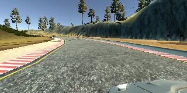

# Udacity Self Driving Car Nanodegree - Behavioral Cloning Project

The goals / steps of this project are the following:
* Use the simulator to collect data of good driving behavior
* Build, a convolution neural network in Keras that predicts steering angles from images
* Train and validate the model with a training and validation set
* Test that the model successfully drives around track one without leaving the road
* Summarize the results with a written report

## Rubric Points

Here I will consider the [rubric points](https://review.udacity.com/#!/rubrics/432/view) individually and describe how I addressed each point in my implementation.

### Files Submitted & Code Quality

#### 1. Submission includes all required files and can be used to run the simulator in autonomous mode

My project includes the following files:
* model.py containing the script to create and train the model
* drive.py for driving the car in autonomous mode
* model.h5 containing a trained convolution neural network (not part of this repo, [link to download](https://drive.google.com/open?id=0B9eatljI4gpBdEY3SzRUV0FFZ2M))
* README.md summarizing the results

#### 2. Submission includes functional code

**NOTE:** due to GitHub file size limits, the `model.h5` isn't tracked by git and can be downloaded from [here](https://drive.google.com/open?id=0B9eatljI4gpBdEY3SzRUV0FFZ2M).

Using the Udacity provided simulator and my drive.py file, the car can be driven autonomously around the track by executing:

```sh
docker run -it --rm -v `pwd`:/src -p 4567:4567 udacity/carnd-term1-starter-kit python drive.py model.h5
```

#### 3. Submission code is usable and readable

The model.py file contains the code for training and saving the convolution neural network. The file shows the pipeline I used for training and validating the model, and it contains comments to explain how the code works.

### Model Architecture and Training Strategy

#### 1. An appropriate model architecture has been employed

I've chosen NVIDIA's [end-to-end learning model](https://arxiv.org/pdf/1604.07316.pdf) since it's the model designed to solve this type of problem.
My model consists of a convolution neural network with 3x3 and 5x5 filter sizes and depths between 24 and 64 (model.py lines 141-151). Before entering convolution layers, data is cropped (model.py lines 141) and normalized (model.py lines 142). On top of convolutional layers, there are 4 fully connected layers with 1164 neurons as input and one neuron as output (model.py lines 154-161). Each layer (except the very last one) uses ELU as an activation function, that [is proved to perform better than ReLU](https://arxiv.org/pdf/1511.07289.pdf).

#### 2. Attempts to reduce overfitting in the model

The model contains 20% dropout layers in order to reduce overfitting (model.py lines 144 and below).

The model was trained and validated on different data sets to ensure that the model was not overfitting (model.py line 128). The model was tested by running it through the simulator and ensuring that the vehicle could stay on the track.

#### 3. Model parameter tuning

The model used an Adam optimizer (model.py lines 165), batch size 64, 30 epochs with early stopping with patience 3 when validation loss stops decreasing (model.py line 175).

#### 4. Appropriate training data

Training data was chosen to keep the vehicle driving on the road. I used a combination of center lane driving, recovering from the left and right sides of the road, 2 different track, 2 driving directions on each track.

For details about how I created the training data, see the next section.

### Model Architecture and Training Strategy

#### 1. Solution Design Approach

My approach to solve the problem was next:

1. Test that all components are working together, I can generate test data, I can use GPU for training, the simulator can communicate with the trained model. For that, I used a trivial one-layer network. Of cause, it performed very badly and yielded random steering angles, but I made sure all components work.

2. I tried LeNet architecture since I worked with it on the previous project and it's very fast to train and test - the result was still bad, the car couldn't stay on the track. It was obvious for me I need something bigger and more powerful.

3. I decided to use NVIDIA's model because this model is designed for this type of problem, so why re-invent the steering wheel 😀?

4. Initial training included just one lap on track 1 - that wasn't enough, there were issues with some corner cases so I needed to gather more training data (see below in the section about training and validation sets).

5. At the end of the process, the vehicle is able to drive autonomously around both tracks without leaving the road. Mission accomplished.

#### 2. Final Model Architecture

The final model architecture (model.py lines 18-24) consisted of a convolution neural network with the following layers and layer sizes:

```
____________________________________________________________________________________________________
Layer (type)                     Output Shape          Param #     Connected to
====================================================================================================
cropping2d_1 (Cropping2D)        (None, 90, 320, 3)    0           cropping2d_input_1[0][0]
____________________________________________________________________________________________________
lambda_1 (Lambda)                (None, 90, 320, 3)    0           cropping2d_1[0][0]
____________________________________________________________________________________________________
convolution2d_1 (Convolution2D)  (None, 43, 158, 24)   1824        lambda_1[0][0]
____________________________________________________________________________________________________
dropout_1 (Dropout)              (None, 43, 158, 24)   0           convolution2d_1[0][0]
____________________________________________________________________________________________________
convolution2d_2 (Convolution2D)  (None, 20, 77, 36)    21636       dropout_1[0][0]
____________________________________________________________________________________________________
dropout_2 (Dropout)              (None, 20, 77, 36)    0           convolution2d_2[0][0]
____________________________________________________________________________________________________
convolution2d_3 (Convolution2D)  (None, 8, 37, 48)     43248       dropout_2[0][0]
____________________________________________________________________________________________________
dropout_3 (Dropout)              (None, 8, 37, 48)     0           convolution2d_3[0][0]
____________________________________________________________________________________________________
convolution2d_4 (Convolution2D)  (None, 6, 35, 64)     27712       dropout_3[0][0]
____________________________________________________________________________________________________
dropout_4 (Dropout)              (None, 6, 35, 64)     0           convolution2d_4[0][0]
____________________________________________________________________________________________________
convolution2d_5 (Convolution2D)  (None, 4, 33, 64)     36928       dropout_4[0][0]
____________________________________________________________________________________________________
dropout_5 (Dropout)              (None, 4, 33, 64)     0           convolution2d_5[0][0]
____________________________________________________________________________________________________
flatten_1 (Flatten)              (None, 8448)          0           dropout_5[0][0]
____________________________________________________________________________________________________
dense_1 (Dense)                  (None, 1164)          9834636     flatten_1[0][0]
____________________________________________________________________________________________________
dropout_6 (Dropout)              (None, 1164)          0           dense_1[0][0]
____________________________________________________________________________________________________
dense_2 (Dense)                  (None, 100)           116500      dropout_6[0][0]
____________________________________________________________________________________________________
dropout_7 (Dropout)              (None, 100)           0           dense_2[0][0]
____________________________________________________________________________________________________
dense_3 (Dense)                  (None, 50)            5050        dropout_7[0][0]
____________________________________________________________________________________________________
dropout_8 (Dropout)              (None, 50)            0           dense_3[0][0]
____________________________________________________________________________________________________
dense_4 (Dense)                  (None, 10)            510         dropout_8[0][0]
____________________________________________________________________________________________________
dense_5 (Dense)                  (None, 1)             11          dense_4[0][0]
====================================================================================================
Total params: 10,088,055
Trainable params: 10,088,055
Non-trainable params: 0

```

#### 3. Creation of the Training Set & Training Process

To capture good driving behavior, I first recorded two laps on track one using center lane driving. Here is an example image of center lane driving (left, center and right cameras):


Also, there are images from left and right cameras. During training, these images are being used together with central camera images, but with adjusted steering angle - we got 3 times more training data and the model learns better how to recover from off-center position.




To get even better recovering, I've recorded the vehicle starting its movement from the left side and right sides of the road back to center:


On the image above, the vehicle is recovering from the right side of the road while being located next to a water surface - the model had a hard time distinguishing road surface vs water surface on early stages of training (or maybe it just liked swimming better than driving 😀):


Then I repeated this process on track 2 in order to get more data points. Here's another example of a failed image recognition - the car thinks the road goes straight forward, although it's just a background and the real road turns right:


To fix this, I had to do additional recovery training on that particular spot of the road.

I randomly applied train data augmentations to help the model to generalize better:

1. One-third of all images are randomly flipped

     →
    

2. Another one-third was made randomly darker or brighter

     →
    

     →
    

Finally, I've cropped 50 pixels from the top (removing sky) and 20 pixels from the bottom (car hood) - this is noise the model shouldn't care about.

 →


The total number of images:

* train samples: 14,765 (we can count it as 44,295 samples because every sample has 3 images from left, center, and right cameras)
* validation samples: 3,692 (random 20% of all samples, just central camera)

I used these training samples for training the model. The validation set helped determine if the model was over or under fitting. The ideal number of epochs was 30, because the validation loss stopped dropping at that point:


```
Epoch 1/30
44295/44295 [==============================] - 52s - loss: 0.0872 - val_loss: 0.0445
Epoch 2/30
44295/44295 [==============================] - 50s - loss: 0.0561 - val_loss: 0.0401
Epoch 3/30
44295/44295 [==============================] - 49s - loss: 0.0480 - val_loss: 0.0377
Epoch 4/30
44295/44295 [==============================] - 49s - loss: 0.0438 - val_loss: 0.0310
Epoch 5/30
44295/44295 [==============================] - 49s - loss: 0.0398 - val_loss: 0.0290
Epoch 6/30
44295/44295 [==============================] - 49s - loss: 0.0372 - val_loss: 0.0264
Epoch 7/30
44295/44295 [==============================] - 49s - loss: 0.0347 - val_loss: 0.0237
Epoch 8/30
44295/44295 [==============================] - 49s - loss: 0.0315 - val_loss: 0.0211
Epoch 9/30
44295/44295 [==============================] - 49s - loss: 0.0298 - val_loss: 0.0215
Epoch 10/30
44295/44295 [==============================] - 49s - loss: 0.0283 - val_loss: 0.0179
Epoch 11/30
44295/44295 [==============================] - 49s - loss: 0.0304 - val_loss: 0.0188
Epoch 12/30
44295/44295 [==============================] - 49s - loss: 0.0250 - val_loss: 0.0161
Epoch 13/30
44295/44295 [==============================] - 49s - loss: 0.0232 - val_loss: 0.0164
Epoch 14/30
44295/44295 [==============================] - 49s - loss: 0.0224 - val_loss: 0.0154
Epoch 15/30
44295/44295 [==============================] - 49s - loss: 0.0206 - val_loss: 0.0132
Epoch 16/30
44295/44295 [==============================] - 49s - loss: 0.0196 - val_loss: 0.0125
Epoch 17/30
44295/44295 [==============================] - 49s - loss: 0.0185 - val_loss: 0.0122
Epoch 18/30
44295/44295 [==============================] - 49s - loss: 0.0185 - val_loss: 0.0119
Epoch 19/30
44295/44295 [==============================] - 49s - loss: 0.0175 - val_loss: 0.0109
Epoch 20/30
44295/44295 [==============================] - 49s - loss: 0.0158 - val_loss: 0.0100
Epoch 21/30
44295/44295 [==============================] - 50s - loss: 0.0161 - val_loss: 0.0105
Epoch 22/30
44295/44295 [==============================] - 49s - loss: 0.0151 - val_loss: 0.0096
Epoch 23/30
44295/44295 [==============================] - 49s - loss: 0.0146 - val_loss: 0.0098
Epoch 24/30
44295/44295 [==============================] - 49s - loss: 0.0136 - val_loss: 0.0095
Epoch 25/30
44295/44295 [==============================] - 49s - loss: 0.0130 - val_loss: 0.0091
Epoch 26/30
44295/44295 [==============================] - 49s - loss: 0.0127 - val_loss: 0.0103
Epoch 27/30
44295/44295 [==============================] - 49s - loss: 0.0124 - val_loss: 0.0088
Epoch 28/30
44295/44295 [==============================] - 49s - loss: 0.0119 - val_loss: 0.0088
Epoch 29/30
44295/44295 [==============================] - 49s - loss: 0.0125 - val_loss: 0.0098
Epoch 30/30
44295/44295 [==============================] - 49s - loss: 0.0120 - val_loss: 0.0089
```


## The Final Result

### Track 1

[](https://www.youtube.com/watch?v=hSxiL1BXkG0)
[](https://www.youtube.com/watch?v=R0mGx0tbfXE)

*(Click to see the videos)*

### Track 2

[](https://www.youtube.com/watch?v=53gG18FK-rU)
[](https://www.youtube.com/watch?v=OFbJ1MEnlP8)

*(Click to see the videos)*

## Things to improve

1. On track 1 the car occasionally starts moving left and right instead of just staying in the middle of the road. It feels like even more training data could solve this problem.

2. On track 2 the car moves in the middle of the road, using the central line as a guide line, instead of using the left lane. I tried to train the model to stay in the left lane only, but because I randomly flipped training images, the model got confused about left and right lanes, that affected stability of the car. Looks like image flipping isn't a good idea for real world multi-lane traffic.
